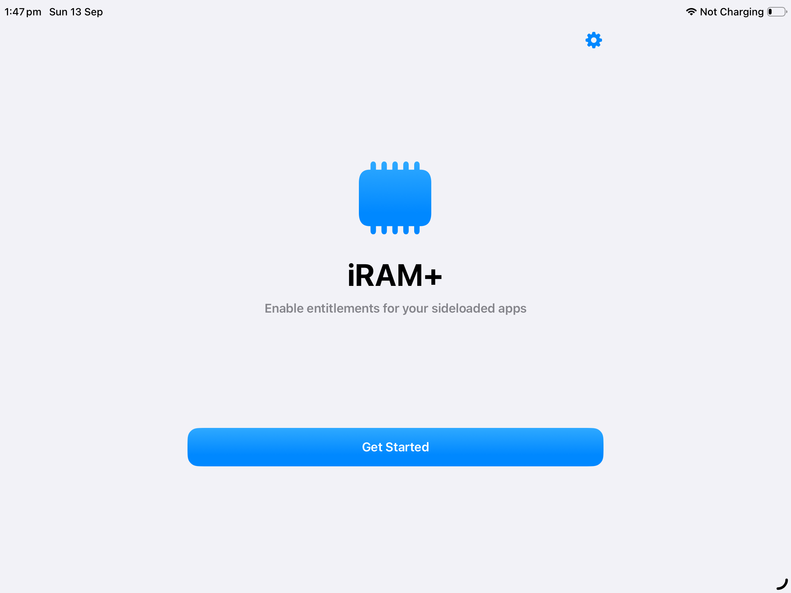
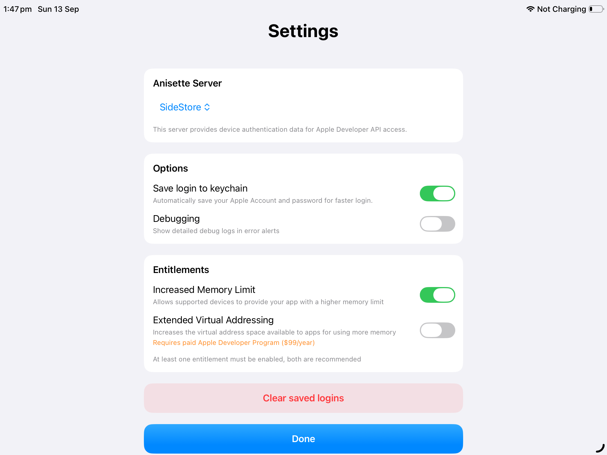
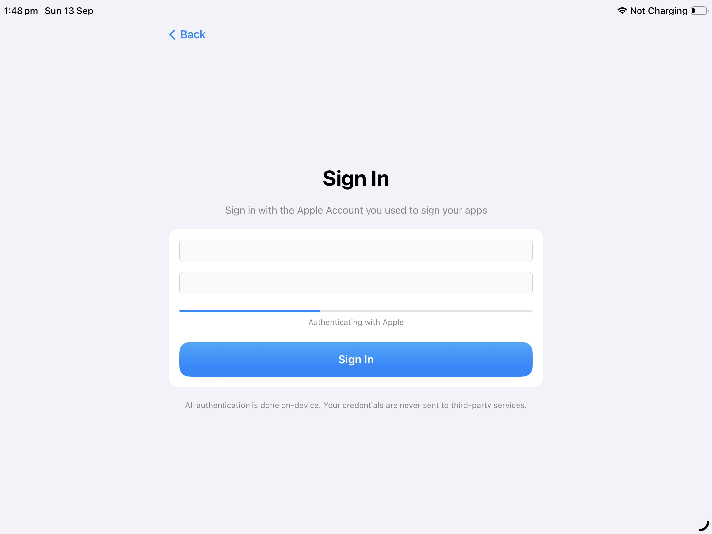
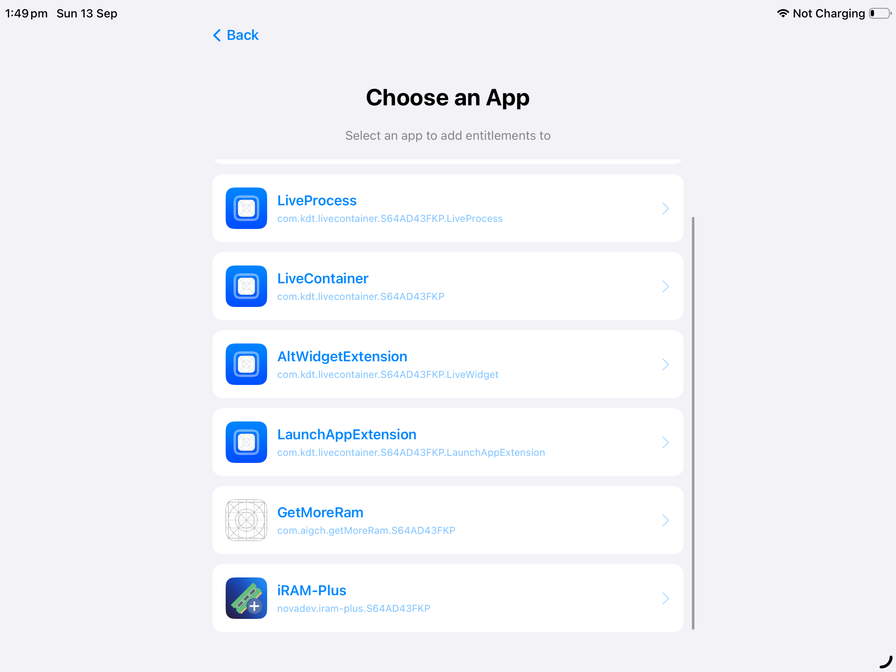
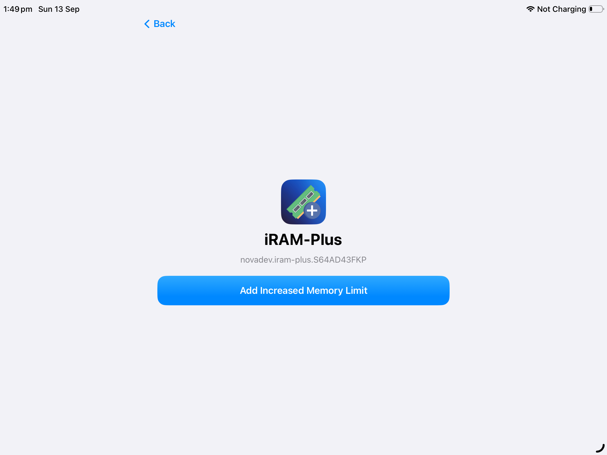
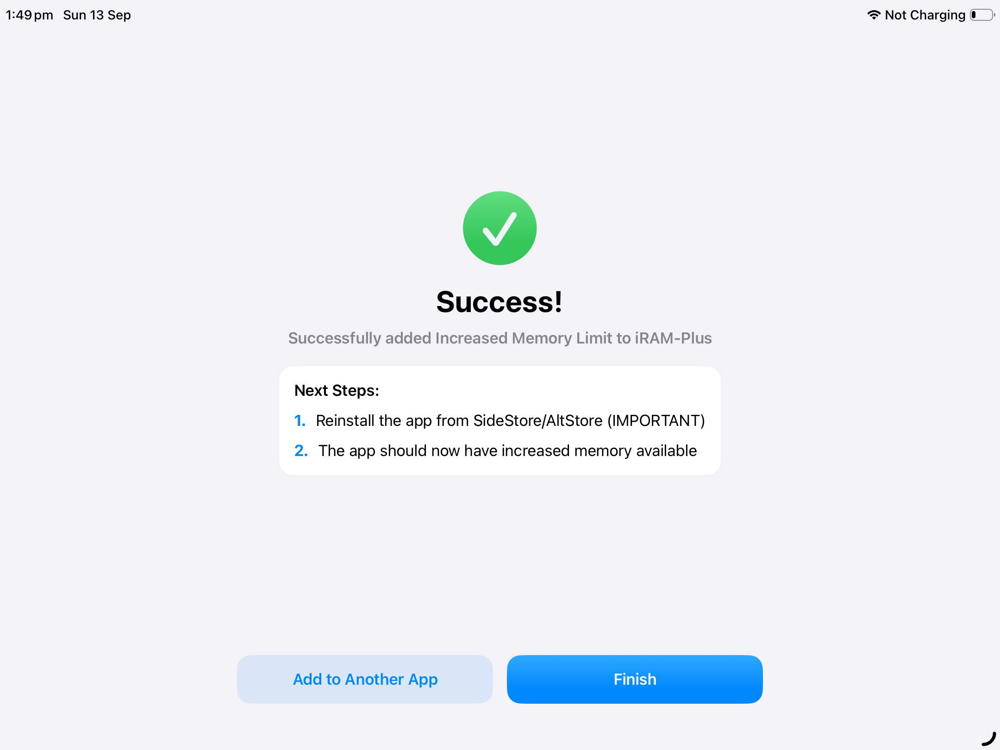

<div align="center">
  

  <h1>iRAM+</h1>

  <p>
    Enable <code>Increased Memory Limit</code> for your sideloaded apps,
    directly on device.
  </p>

  <p>
    <a href="https://github.com/NovaDev404/iRAM-Plus/releases/latest">
      
    </a>
    <a href="https://github.com/NovaDev404/iRAM-Plus/stargazers">
      
    </a>
    <a href="https://github.com/NovaDev404/iRAM-Plus/blob/main/LICENSE">
      
    </a>
  </p>
</div>

<br>

> [!WARNING]
> iRAM+ can only enable Increased Memory Limit for apps signed with an **Apple account**.
> It does **not** work with apps installed using public enterprise certificates. Although, you can *install* iRAM+ with an enterprise certificate.

---

## ✨ Features

* 📱 Enable **Increased Memory Limit** and **Extended Virtual Addressing**, directly on-device
* 🔐 Sign in with the Apple account used to sign your app
* 🔄 Apply the entitlement to existing sideloaded apps
* ⚡ No computer required
* 🎨 Native iOS step-by-step wizard interface

---

## 📲 How to use

### 1. Download iRAM+
Download the latest IPA from the [latest release](https://github.com/NovaDev404/iRAM-Plus/releases/latest/download/iRAM-Plus.ipa).
### 2. Sideload iRAM+
Install the IPA using your preferred sideloading method, such as SideStore, LiveContainer, iLoader, or [Direct Install](https://install.sideloading.net/#apps).
### 3. Sign in
Open iRAM+ and sign in with your Apple Account.
### 4. Select your app
Tap the app you want to enable Increased Memory Limit for.
### 5. Add the entitlement
Tap **Add Increased Memory Limit**.
### 6. Reinstall the app
Reinstall the modified app through SideStore, or your preferred sideloading method.
### 7. Verify

Open the app and check whether **Increased Memory Limit** is now enabled.

---

## 📸 Screenshots

<p align="center">
  
  &nbsp;&nbsp;
  
  &nbsp;&nbsp;
  
</p>

<p align="center">
  
  &nbsp;&nbsp;
  
  &nbsp;&nbsp;
  
</p>

---

## 🙏 Credits

- **NovaDev404** — Creator of iRAM+
- **Huge_Black** — Creator of GetMoreRam
- **Stossy11** — Creator of StosSign
- **SideStore** — Anisette data-fetching code

---

## 📄 License

See the [LICENSE](LICENSE) file for more information.

### Apple Account sign-in and two-factor authentication

Sign-in uses [SideSign](https://github.com/SideStore/SideSign) revision
`df2b8e4257454f0c7629276d409d6e9d7953fdf6`, matching SideStore's dependency
when this integration was updated. Choose **Apple Device**, **Text Message**, or
**Phone Call**, then enter the six-digit code. If Apple provides multiple trusted
numbers, select the number before requesting a code. Use the delivery buttons
again to resend or change methods; incorrect codes can be retried in place.

Sign-in completes only after authentication and developer-team lookup both
succeed. Back and Cancel Sign In cancel the pending challenge. Credentials are
saved in Keychain only when the existing save-login setting is enabled.

The `iRAM-PlusTests` target covers code validation, duplicate submissions, phone
selection, retry/channel changes, and cancellation. End-to-end authentication
still requires an Apple Account and a reachable anisette server on a device.

### Build an IPA on macOS

Install full Xcode (tested with Xcode 26.3), open it once to finish setup, then
run from the repository directory:

```sh
./build-ipa.sh
```

The script builds a Release archive for physical iOS devices and creates
`build/iRAM-Plus.ipa`. Import this **unsigned IPA** into SideStore, AltStore, or
Sideloadly to sign and install it. No signing certificate is needed to build it.
The first build downloads dependencies; subsequent builds reuse the local cache.
Build output is also saved to `build/build-ipa.log`.

To choose an output path or Xcode installation:

```sh
./build-ipa.sh --output ~/Desktop/iRAM-Plus.ipa
DEVELOPER_DIR=/Applications/Xcode.app/Contents/Developer ./build-ipa.sh
```

Run `./build-ipa.sh --help` for build-cache options. The script uses the committed
package lockfile so the IPA includes the pinned authentication dependencies.
